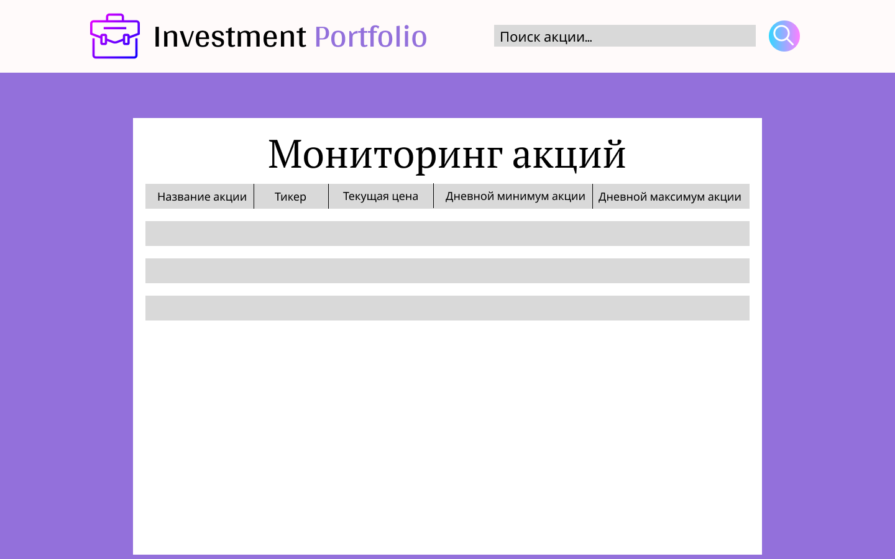

# Tiker

### Описание задачи

Требуется написать **web-приложение** для отображения *котировок акций*.

**Пользователь** должен иметь возможность **зайти на сайт, в поле поиска акций ввести тикер** *(тикер акции - это ее краткое название, по типу APPL, U, YNDX)*; **нажать на кнопку добавить**. После добавления, ниже поля поиска, **появляется карточка с краткой информацией об акции** *(название акции, тикер, текущая цена, дневной минимум акции, дневной максимум акции)*. **Информация о акции должна обновляться в режиме реального времени** *(каждую минуту)*.

**Пользователь может добавить неограниченное кол-во акций на страницу**.

**Пользователь должен иметь возможность сохранять свои введенные акции** (то есть после закрытия сайта и открытии его снова, пользователь должен увидеть все свои сохраненные акции).

### Технические требования

+ **Сайт должен соответствовать современным стандартам разработки** *(иметь user-friendly интерфейс, открываться во всех основных браузерах (google chrome, opera, firefox))*;
+ **Сайт должен взаимодействовать с сервером**;
+ **Каждый пользователь должен иметь возможность сохранять акции, которые он искал, даже после закрытии вкладки с сайтом**.

Для получения данных котировок на стороне сервера используйте Yahoo API. Пример ссылки для получения котировки: https://query1.finance.yahoo.com/v10/finance/quoteSummary/U?modules=price, где U - это тикер компании Unity Technologies
Сервер должен уметь отправлять информацию об акции по запросу с сайта.

### Необязательные требования, но хорошо было бы иметь

+ **Сервер сохраняет данные об акциях в SQL базу данных, при запросе с сайта данные отправляются из базы данных**;
+ **Сервер может выдержать высокую нагрузку**. То есть будет работать безошибочно, если одновременно 1000 или более пользователей запросят информацию о какой-либо акции;
+ **Пользователь может удалять ранее сохраненные акции**.

## Предпросмотр страницы

 <b>Первоначальный эскиз</b> 

